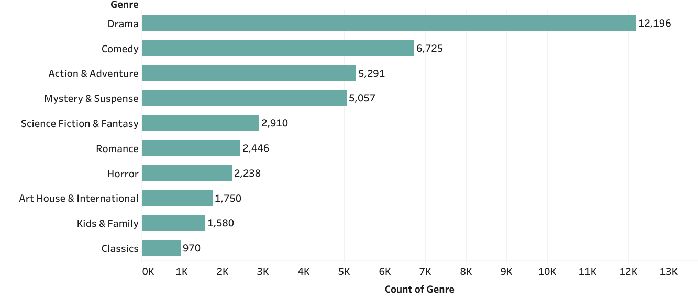
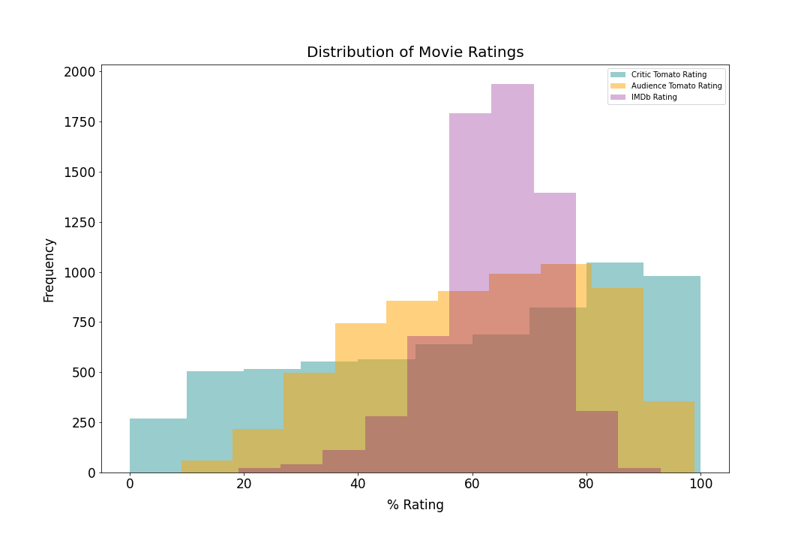
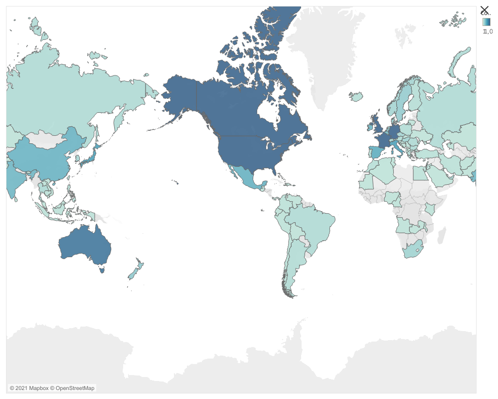
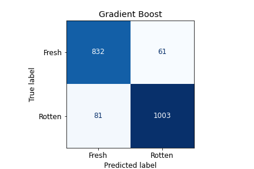
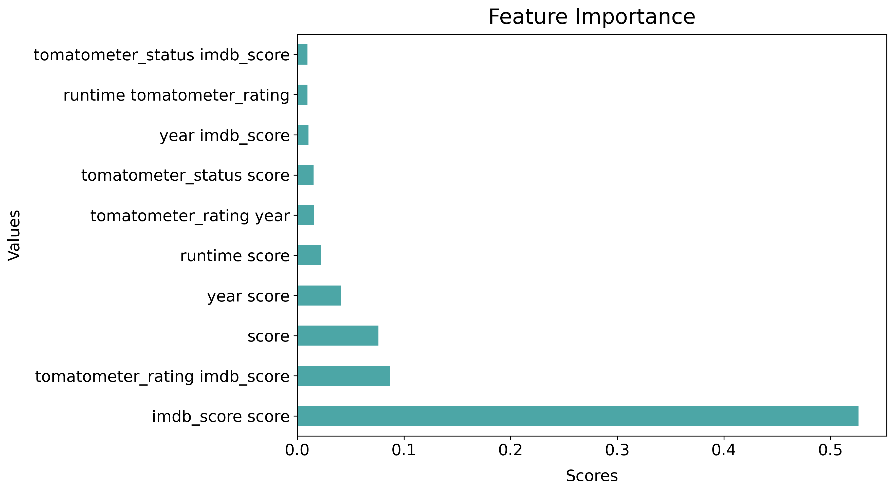

# Capstone: Movie Data Classification and Recommender System
## Jen Zieger ##
___

#### Tables of Contents:
1. [Overiew and Problem Statement](#Overview-and-Problem-Statement)
2. [Data Collection and Cleaning](#Data-Collection-and-Cleaning)
3. [Exploratory Data Analysis](#Exploratory-Data-Analysis)
4. [Classification Pre-processing and Modeling](#Classification-Pre-processing-and-Modeling)
5. [Classification Modeling Evaluation](#Classification-Modeling-Evaluation)
6. [Recommender System Pre-processing and Modeling](#Recommender-System-Pre-processing-and-Modeling)
7. [Recommender System Evaluation](#Recommender-System-Evaluation)
8. [Flask Development](#Flask-Development)
9. [Conclusion and Recommendations](#Conclusions-and-Recommendations)
10. [Modeling Resources](#Modeling-Resources)

### Overview and Problem Statement

#### Scenario
Have you ever found yourself searching through your tv network and streaming platforms looking for something to watch, only to realize you’ve wasted half of your time looking for a movie? If you are part of the 78% of consumers in the U.S. who use a subscription video-on-demand service [[1]](https://www.statista.com/statistics/318778/subscription-based-video-streaming-services-usage-usa/#:~:text=According%20to%20the%20most%20recent,25%20percent%20in%20five%20years.), the answer is probably yes.

While sometimes the algorithms recommending something to watch can be helpful, sometimes they are not. Many times, these platform services recommend a movie but do not provide the ratings of others’ reviews to back up those recommendations.

A new streaming service’s production company has recognized this issue, and they are looking for a way to recommend movies to viewers differently than some of their competitors. They are also looking for a new way to predict if their new movie releases will be rated as Fresh or Rotten by audience viewers on Rotten Tomatoes. Since Rotten Tomato critic reviews usually get published first, they want to predict what the audience will vote once the movie is released to the general public.

This company outsourced this project to me, and I developed a machine learning model to predict audience Rotten Tomato audience ratings, as well as a user-friendly recommendation system that's a bit different than what’s out there currently.

#### Problem Statement
Given movie review information, what features predict if an audience will rate a movie as Fresh or Rotten on Rotten Tomatoes, and how can that information be used to build a recommender system that can be used to exceed user expectations?

#### Overview of Rotten Tomatoes and IMDb

**Rotten Tomatoes**  
Rotten Tomatoes and the Tomatometer score are the world’s most trusted recommendation resources for quality entertainment. As the leading online aggregator of movie and TV show reviews from critics, we provide fans with a comprehensive guide to what’s Fresh – and what’s Rotten – in theaters and at home. [[2]](https://www.rottentomatoes.com/about)

**IMDb**  
Launched online in 1990 and a subsidiary of Amazon.com since 1998, IMDb is the world's most popular and authoritative source for movie, TV and celebrity content, designed to help fans explore the world of movies and shows and decide what to watch. [[3]](https://help.imdb.com/article/imdb/general-information/what-is-imdb/G836CY29Z4SGNMK5?ref_=__seemr#)

**Strategy**  
My strategy for this project included the following steps:
1. Data Collection and Cleaning
2. Exploratory Data Analysis
3. Pre-Processing – Classification
4. Classification Modeling and Evaluation
5. Pre-Processing – Recommender System
6. Recommender System Modeling and Evaluation
7. Website Development
8. Conclusions and Recommendations

### Data Collection and Cleaning

For my project, I combined two movie and critic datasets from Kaggle. One being from Rotten Tomatoes and the other from IMDb. The Rotten Tomatoes dataset was my primary dataset for this project, while the IMDb dataset added additional rating and description information.  

1. [Rotten Tomatoes Movies and Critic Reviews](https://www.kaggle.com/stefanoleone992/rotten-tomatoes-movies-and-critic-reviews-dataset)
1. [IMDb Movies](https://www.kaggle.com/stefanoleone992/imdb-extensive-dataset?select=IMDb+movies.csv)

The Rotten Tomatoes dataset was from 2020 and consisted of over 1.1M critic reviews with over 17K movie titles. This dataset had movie information had a vast amount of information including titles, plot, director, cast, release dates, individual critic reviews, critic consensus reviews, and audience reviews.

Rotten tomato critic ratings range from 0-100%, and audience ratings range from 0-5 stars. Any movie rating with an average of 59% or less is considered “Rotten,” while anything 60% or higher is considered “Fresh.”

The IMDb dataset was also from 2020 and consisted of over 85K movie titles and user reviews. This dataset also had general movie information such as title, plot, director, etc., as well as the weighted average movie ratings of users.

IMDb ratings range from 0-10, with zero being the lowest score and ten being the highest.

When combining the data, I merged the title to create a main DataFrame that consisted of the following features:

**Data Dictionary**

|Feature|Type|Description|
|---|---|---|
|**rt_id**                  | object        | Rotten Tomatoes Movie Id |
|**critic_name**            | object        | Rotten Tomatoes Critic Name |
|**publisher**              | object        | Rotten Tomatoes Critic's Publisher |
|**review_type**            | int64         | Rotten Tomatoes Critic's Review - Fresh or Rotten|
|**review_date**            | datetime64[ns]| Rotten Tomatoes Date of Critic Review |
|**review_content**         | object        | Rotten Tomatoes Critic's Content of the Review |
|**title**                  | object        | Movie Title |
|**plot**                   | object        | Rotten Tomatoes Movie Plot |
|**critics_consensus**      | object        | Rotten Tomatoes Critic Consensus Review of Movie |
|**content_rating**         | object        | Content Rating on the Movie Suitability for Audience |
|**genre**                  | object        | Movie Genre |
|**director**               | object        | Movie Director |
|**writer**                 | object        | Movie Writer |
|**cast**                   | object        | Movie Cast |
|**original_release_date**  | datetime64[ns]| Movie's Original Release Date |
|**streaming_release_date** | datetime64[ns]| Movie's Streaming Release Date |
|**runtime**                | float64       | Movie Runtime (in minutes) |
|**production_company**     | object        | Movie's Production Company |
|**tomatometer_status**     | int64         | Tomatometer Status - Fresh or Rotten |
|**tomatometer_rating**     | float64       | Tomatometer Rating - Critics Consensus Score |
|**tomatometer_count**      | float64       | Tomatometer Count of Critics |
|**audience_status**        | int64         | Rotten Tomatoes Audience Status - Fresh or Rotten |
|**audience_rating**        | float64       | Rotten Tomatoes Audience Rating - Score |
|**audience_count**         | float64       | Rotten Tomatoes Count of Audience |
|**critic_id**              | int64         | Rotten Tomatoes Critic Id |
|**review_score**           | float64       | Rotten Tomatoes Individual Critic's Score |
|**year**                   | int64         | Year of Original Movie Release |
|**imdb_title**             | object        | IMDb Movie Id |
|**country**                | object        | Country of Movie Production |
|**imdb_plot**              | object        | IMDb Movie Plot |
|**imdb_score**             | float64       | IMDb Average Vote Rating |
|**imdb_count**             | float64       | IMDb Number of Votes Recieved |
|**review_negative**        | float64       | Individual Critic Content Sentiment Negativity Score |
|**review_neutral**         | float64       | Individual Critic Content Sentiment Neutral Score |
|**review_positive**        | float64       | Individual Critic Content Sentiment Positive Score |
|**review_compound**        | float64       | Individual Critic Content Sentiment Compound Score |
|**consensus_negative**     | float64       | Critic Consensus Content Sentiment Negativity Score |
|**consensus_neutral**      | float64       | Critic Consensus Content Sentiment Neutral Score |
|**consensus_positive**     | float64       | Critic Consensus Content Sentiment Positive Score |
|**consensus_compound**     | float64       | Critic Consensus Content Sentiment Compound Score |
|**score**                  | float64       | Aggregated Score - IMDb & Rotten Tomatoes |

Through data cleaning methods, I ensured there were no duplicate submissions and that there were unique critic reviews for each movie row. I also checked datatypes, outliers, dropped unnecessary rows/columns and used feature engineering when needed.

To have all of the ratings on the same scale, I used Rotten Tomatoes’ Tomatometer rating scale as the primary scale for the scores, ranging from 0-100%. I also created a new feature, `score`, that consisted of the weighted aggregated rating score of the Rotten Tomatoes’ individual critic review rating - `review_score`, critic consensus rating - `tomatometer_rating`, audience rating - `audience_rating`, and IMDb’s score - `imdb_score`.

I used KNN imputer for the missing values in the numeric columns that included ratings and counts. I also ensured there were no other null values in the remaining columns by either dropping the null rows or removing unnecessary columns. I used one-hot encoding to replace “Fresh” with 1 and “Rotten” with 0 for the appropriate rating columns.

After combining and cleaning the data, the primary dataset had 6,587 movie titles and critic/audience reviews.

Data Collection and Cleaning can be found in 01_Data_Collection_Cleaning.ipynb

### Exploratory Data Analysis

During the EDA process, I analyzed the following areas:
- Correlations
- Summary Statistics
- Top Feature Counts
    - Genres, Directors, Production Companies, etc.
- Rotten vs. Fresh Rotten Tomato Review Distribution
    - Audience, Individual Critics, and Critic Consensus
- Distribution of Movie Ratings as well as other numerical features
- Sentiment Analysis
    - Rotten Tomatoes’ Individual Critic Reviews and Critic Consensus Reviews
- Country Representation
- Time Analysis & More

A few interesting findings include:

As the company plans future productions, it’s also helpful to consider the density of the types of genres available. Drama is almost listed twice as many times as comedy alone. And a movie can have multiple genres, which is why you see such a high count here.

What’s good to see is that the distribution of ratings is all skewed to the left, which means that people tend to give movies higher ratings. IMDb scores are much more condensed, while Rotten Tomatoes critic and audience scores are a bit more dispersed.

Here you can see the countries with the most titles are in the dark blue, and the least in light blue U.S., Canada, Australia, parts of Europe Have the highest count of movie titles.

Exploratory Data Analysis can be found in 02_EDA.ipynb

### Classification Pre-Processing and Modeling

Due to memory restrictions, I subset the data by grouping movies by 1 (removing any movie rows that had more than 1 count).

As the first part of the project was to find what features predict if an audience will rate a movie as Fresh or Rotten, I used classification modeling as the target variable was binary, Fresh or Rotten.

In order to prepare the data for modeling, I combined object features `title, Rotten Tomato plot, director, cast, critic consensus, and IMDb plot` named, `text`, and used Count Vectorizer to vectorize this column, removing stop words, setting text to lowercase, creating a minimum frequency of 2 and a maximum frequency of .9, and finally setting max features to 3000. I used one-hot-encoding for the genre column, as I wanted to use these as separate features for my modeling.  

For modeling, I used 3,024 features, with the target variable being `audience_status`. I removed features `audience_rating` and `audience_count`, as we would not have this information to predict the audience status.

I tested ten different models including, Logistic Regression, K-Nearest Neighbors, Bernoulli Naïve Bayes, Decision Tree, Random Forest, SVM, Gradient Boost, Bagging, Ada Boost, and Neural Networks.

I ran these models with GridSearch using both the original features and polynomial features. The majority of the models performed better once the polynomial features were used.

Pre-processing can be found in 03_Classification_Pre_Process.ipynb
Modeling can be found in 04.1_Classification_Modeling.ipynb, 04.2_Classification_Modeling_Poly.ipynb, and 04.3_Classification_Modeling_NN.ipynb

### Classification Modeling Evaluation

In this scenario, having false positives (predicting Rotten, when actually Fresh) and having false negatives (predicting Fresh, when actually Rotten) were held at the same level of failure. Hence, I evaluated these models' success based on their accuracy score.

 The top three performing models were:

  |Model|Gradient Boost|Bagging Classifier|Decision Tree|
  |---|---|---|---|
  | Train Accuracy | 1.00 | 1.00 | 0.932  |
  | Test Accuracy | 0.928 | 0.919 | 0.880 |
  | Precision | 0.942 | 0.933 | 0.897 |
  | Recall | 0.925 | 0.918 | 0.8819 |
  | Specificity | 0.931 | 0.920 | 0.877 |
  | Misclassification | 0.718 | 0.080 | 0.119 |
  | F1 Score | 0.933 | 0.926 | 0.889 |

All of these models used feature-engineered polynomial features. Although a bit overfit, the Gradient Boost model was best performing with a training accuracy score of 1.0 and test accuracy score of 0.928, which is 0.38 higher than the baseline model. This model used a 0.25 learning rate, a max depth of 5, and 300 estimators.

**False Positive:** This is how many were predicted Rotten and were actually Fresh.
**False Negative:** This is how many were predicted Fresh and were actually Rotten.
**True Positive:** This is how many were correctly predicted Fresh.
**True Negative:** This is how many were correctly predicted Rotten.

When evaluating the feature importance of this model, the most important predictor was the product of the `score and imdb_score` features. This combined feature represented over 50% of the model’s ability to predict the target, audience_status. The second and third most important predictors were the product of the `tomatometer_rating and score` and the individual `score` column.

### Recommender System Pre-Processing and Modeling

Before I started building my recommender systems, I used the following steps to prepare the data:
- Combined Object Columns
    - Title, Rotten Tomatoes’ Plot, Director, Cast, Genre, IMDb Plot, Rotten Tomatoes’ Critics Consensus Content, and Review Content
- Text was converted to a lowercase format
- Contractions, special characters, and stop words were removed
- Used lemmatization and tokenizer on text

Overall, I created six different recommender models, testing both Collaborative Filtering and Content Based Filtering.

I used Sparse Matrix Factorization, Single Value Decomposition(SVD), and K-Nearest Neighbors for my Collaborative Filtering Models. I tested distance metrics including Cosine Distance, Euclidean Distance, and Manhattan Distance. The models used either the critic id or the title to identify the recommendations closest in distance.

I used transformers for my Content Based Filtering Models, including TF-IDF, Count Vectorizer, and spaCy.

To measure my content based filtering models' success, I used cosine similarity to determine what model performed best, as well as using my own movie knowledge to ensure the proper results were being populated.

I ultimately decided to focus on my Content Based Filtering Models. Although it is considered one of the most basic types of recommender systems, I believe I created a successful model that is different from what is currently used on streaming platforms. I focused on allowing users to input what they are in the mood to watch and populated recommended results.

Sparse Matrix Factorization, SVD, and KNN models can be found in 05.1_Recommender_System.ipynb
Content Based Filtering models with spaCy transformations can be found in 05.2_Recommender_System_spaCy.ipynb

### Recommender System Evaluation

My best model wound up being my first model. Using a subset of my dataset with over 13K reviews, I used TF-IDF, modeled and vectorized the dataset, and the user query to find the cosine distances. I then filtered for the top 35 movie titles by cosine similarity score and finally filtered for the top 10 movie recommendations by the score feature.

This model had the lowest cosine similarity scores compared to the other models tested and had the best movie recommended results.

### Flask Development

To put my movie recommender to use, I built a demo website, where users can input a mood, genre, director, actor, really any type of text, and the top movie results will be populated. I used flask and bootstrapping to create this demo website.

Homepage with Form:

Results Page:

### Conclusions and Recommendations

#### Conclusions

**Classification**  
The Gradient boos model had 93% accuracy at predicting a rotten tomatoes audience rating. However, the model was fairly overfit. The polynomial feature score and IMDb score represented over 50% of the model’s predictability.

**Recommender System**  
The best model for this project wound up being the content based filtering model with TF-IDF. It allows users to input a sentence (or more) about what they want to watch and receive recommendations.

Some advantages of this model is that it doesn’t need to know about other users’ data, and it also captures a users' specific interests. One drawback of this model is that it will tend to over-specialize and produce the same results over again. It also doesn't perform as well with some queries as well as others, but this would need to be investigated further before concluding the reasoning.

#### Recommendations and Next Steps

While both the classification model and recommender system model performed well, there is room for improvement.

**Classification Model**  
I would first recommend spending more time testing the model’s parameters and fine-tuning the best model. Since this data was from 2020, I would try to get current data and/or use the entire dataset. My memory limits did not allow for this, but I think this could give us better insight into how the model performs. I would recommend testing this model on predicting the Tomatometer and/or IMDb scores. I would also recommend using additional datasets that include ratings like Metacritic, Google Reviews, etc., and look for supplementary data such as awards and individual audience reviews. Finally, I think it would be interesting to add tv show data and see how the model performs.

**Recommender System**  
When using the existing model, I would recommend using the Content Based Filtering model with TF-IDF. The current model needs some fine-tuning, so I would recommend adding additional parameters and thoroughly testing results.

I would then recommend testing out other models that use NLP transformers and seeing if better results can be generated. It would be helpful to get user feedback as well, so maybe testing the model with a focus group or using A/B testing could help with improvements.

I think the model could benefit from additional ratings and reviews from other data sources, such as getting audience individual scores and ratings. I would also recommend getting tv show data and adding this as an option for users to select.

While the recommender system website was used to demo how the recommender system performs, I believe hiring a web developer would be necessary before deployment. I think it would be helpful to add username and login capabilities, so users can save their search results and mark what movies they’ve already seen. That way, the model can filter those movies out when making recommendations. I would recommend adding a feedback section to get feedback from users on how the website and recommender system can be improved. It would also be essential to use analytic tools to track website traffic and analyze those results.

### Modeling Resources
[Content-Based TF-IDF, CVEC, & spaCy Recommender Systems](https://towardsdatascience.com/build-a-text-recommendation-system-with-python-e8b95d9f251c)
 
[SVD Recommender System](https://www.kaggle.com/cast42/simple-svd-movie-recommender)
 
[KNN Recommender System](https://towardsdatascience.com/how-did-we-build-book-recommender-systems-in-an-hour-part-2-k-nearest-neighbors-and-matrix-c04b3c2ef55c)
# movie_project
